---

### 👨‍💻 Sobre mí

- 🎓 Estudiante de **Ingeniería en Sistemas de Información**, Buenos Aires, Argentina.
- 💼 Buscando mi primer rol profesional como **.NET Junior / Trainee Developer**.
- 🛠️ Autodidacta en **C# / .NET**, con foco en arquitecturas limpias (N-Tier, Clean Architecture).
- 🏠 Armo y mantengo mi propio **homelab** self-hosted (Debian 12 + Docker) — varios de mis
  proyectos nacen de necesidades reales de ese entorno.
- 🐧 Uso **Arch Linux (CachyOS) + Hyprland** como daily driver.
- 🎮 Me interesa la **preservación de videojuegos** como hobby técnico.
- 📚 Actualmente retomando el **piano** — y construyendo una herramienta para eso también 👀.
- ⚡ Filosofía de proyectos: agarrar un problema personal y resolverlo de la forma más
  **general y reusable** posible, para que le sirva a cualquiera, no solo a mí.

---

### 🧰 Tech Stack

**Backend & Lenguajes**

**Frontend**

**Infraestructura & Sistemas**

**Datos & Herramientas**

---

### 🚀 Proyectos destacados

Todos mis proyectos siguen el mismo criterio: nacen de un problema real que tengo, pero están
diseñados para que le sirvan a cualquier desarrollador, no solo a mí.

<table>
<tr>
<td width="50%" valign="top">

**🏠 [homecore-api](https://github.com/juanchiappa/homecore-api)**

Backend REST genérico para monitoreo de homelabs Docker. Sistema de "Service Monitors"
configurable vía plugins — no atado a ningún servicio específico.

`ASP.NET Core` `C#` `Dapper` `JWT` `Docker`

</td>
<td width="50%" valign="top">

**📊 [serverpulse](https://github.com/juanchiappa/serverpulse)**

Dashboard standalone en React para visualizar homelabs. Se conecta a HomeCore API,
Prometheus o al socket de Docker directo vía adaptadores intercambiables.

`React` `TypeScript` `Vite` `TailwindCSS`

</td>
</tr>
<tr>
<td width="50%" valign="top">

**⚙️ [archgen](https://github.com/juanchiappa/archgen)**

CLI opinionado que genera scaffolding de proyectos .NET en múltiples patrones de
arquitectura: N-Tier, Clean Architecture, CQRS, Minimal API.

`C#` `System.CommandLine` `.NET Tool`

</td>
<td width="50%" valign="top">

**🛒 [ProyectoInsumosProductos](https://github.com/juanchiappa/ProyectoInsumosProductos)**

Marketplace B2B de escritorio en C# / WinForms para intercambio de insumos entre
clientes y proveedores. Soporte ES/EN.

`C#` `WinForms` `N-Tier`

</td>
</tr>
</table>

---

### 📈 GitHub Stats

---

💬 Abierto a oportunidades de mi primer rol profesional en **.NET**.
📫 Contactame por [correo](mailto:chiappajuanignacio@gmail.com).

